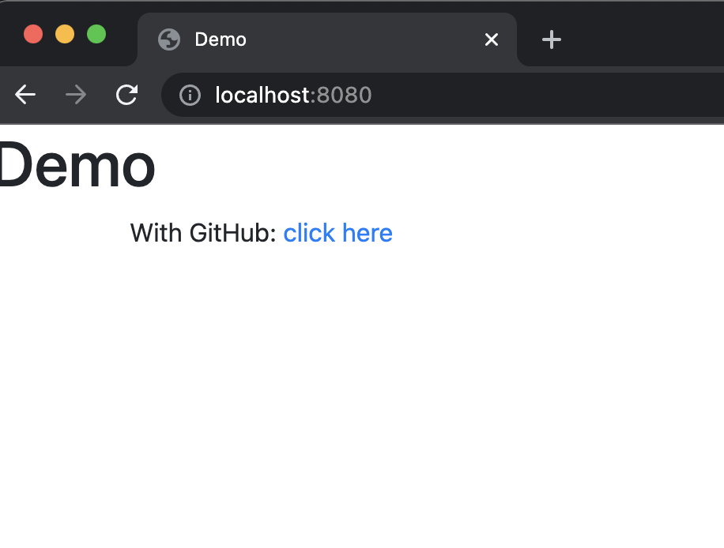

# spring-boot app with external OAuth2 provider

A Simple spring-boot up that helps the user to sign-in using a Github Auth-provider

## Pre-requisites
1. Have a Github ID.
2. Register a Github OAuth Client-app at https://github.com/settings/developers
   1. Individual params over there could be populated using the guidelines given over here -> https://spring.io/guides/tutorials/spring-boot-oauth2/#github-register-application
   2. Copy-down the client-id and client-secret to be passed in as VM args when we run a spring-boot app out from this source-base

## How to run
1. Configure these 2 VM properties in the IDE run-configuration for this spring-boot app(replace the placeholders with your values)
```shell
-Dspring.security.oauth2.client.registration.github.clientId=<github-client-id>
-Dspring.security.oauth2.client.registration.github.clientSecret=<github-client-secret>
```
2. Run the spring-boot app
3. Now open up the browser to submit `http://localhost:8080`. You should be seeing now the landing page as 
4. Click on "click here" link. 
5. Browser now should take you to Github login page where you can sign-in. This step would be skipped if you already have a authenticated github session in your browser.
6. When the browser having an authenticated session back from Github, it should display the logged-in username as in 
7. You can now click on "logout" link
8. Browser now should clear the signed-in session to display back the landing page as in 
